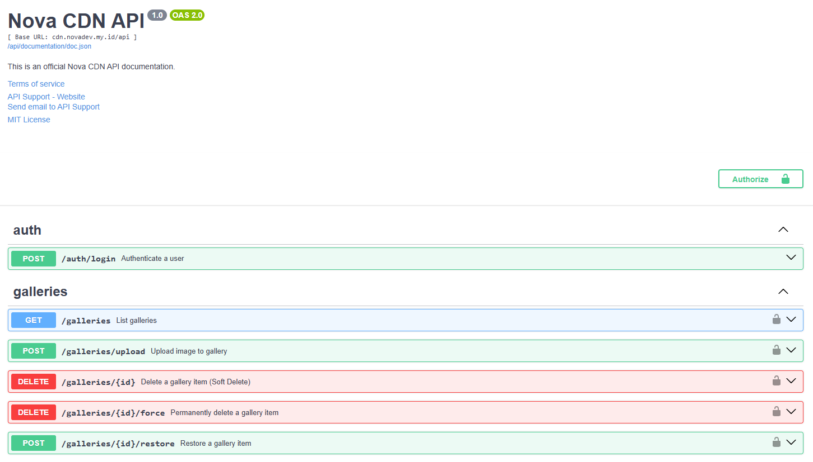

# Nova CDN Service

Hi Future Developer,

Welcome to the **Nova CDN Service**! This project is an open-source Content Delivery Network (CDN) and asset management service built with the Go programming language, designed to be the central hub for storing and serving public assets.

This service was born out of a shared necessity across several other projects, including [golang-api](https://github.com/novaardiansyah/golang-api), [personal-v4](https://github.com/novaardiansyah/personal-v4), [NovaApp](https://github.com/novaardiansyah/NovaApp), and [ocr-server](https://github.com/novaardiansyah/ocr-server). Each of these applications requires a seamless way to manage and serve public assets like images and documents. To streamline this process, Nova CDN was built as a high-performance central hub to handle all asset delivery needs. The service is accessible at [https://cdn.novadev.my.id](https://cdn.novadev.my.id).

## Dazzling Tech Stack! ⚡

- [Go (Golang)](https://go.dev/) - Fast, statically typed, compiled programming language
- [Fiber](https://gofiber.io/) - Express-inspired web framework for Go
- [GORM](https://gorm.io/) - Fantastic ORM library for Golang
- [MySQL](https://www.mysql.com/) - Database Management
- [GoValidator](https://github.com/thedevsaddam/govalidator) - Request validation
- [NFNT Resize](https://github.com/nfnt/resize) - Pure golang image resizing

## Project Structure 🌟

This project follows a clean directory structure to maintain a clear separation of concerns:

- `cmd/api/main.go` - Application entry point and server initialization.
- `internal/config/` - Configuration logic and environment variable management.
- `internal/controllers/` - HTTP request handlers.
- `internal/models/` - Database schemas and GORM models.
- `internal/repositories/` - Data access layer implementing the logic for database operations.
- `internal/routes/` - API route definitions.
- `internal/middleware/` - Custom middleware for logging, CORS, and security.
- `pkg/utils/` - Shared utility functions and response helpers.

## Key Features 🚀

- ✅ **Centralized Asset Management**: Single source for images, files, and public assets.
- ✅ **Image Processing**: On-the-fly resizing and optimization support.
- ✅ **RESTful API**: Standardized operations for file uploads and management.
- ✅ **Soft Deletes**: Native support via GORM for data safety.
- ✅ **Standardized Responses**: Consistent JSON output across all endpoints.
- ✅ **Security**: Endpoint protection with Laravel Sanctum token validation.

## API Documentation 📚

This project includes **integrated API documentation** powered by [Swaggo](https://github.com/swaggo/swag). Access it at: [Official Documentation](https://cdn.novadev.my.id/api/documentation)

## Credentials & Environment 🔐

While this repository is public, please note that all forms of credentials, API keys (including `.env`), and environment configurations are **not provided for the public**. Access to production secrets remains restricted for security reasons.

To get started locally:
1. Copy `.env.example` to `.env`.
2. Configure your local MySQL database settings.
3. Run `go mod tidy` to install dependencies.
4. Run `go run cmd/api/main.go` to start the server.

## API Status 🌐

You can check the API status by visiting the health check endpoint:
- [https://cdn.novadev.my.id/api/health](https://cdn.novadev.my.id/api/health)

## Let's Connect! 📞

Need to chat? Feel free to drop me a line via [Email](mailto:novaardiansyah78@gmail.com) or hit me up on [WhatsApp](https://wa.me/6289506668480?text=Hi%20Nova,%20I%20have%20a%20question%20about%20your%20project%20on%20GitHub:%20https://github.com/novaardiansyah/nova-cdn). I'm just a message away, ready to groove with you! 📩

## Project Status 🚀

## Code of Conduct 🤝

We believe in fostering a welcoming and inclusive environment for everyone. Please be respectful, considerate, and constructive in all interactions. By participating in this project, you agree to uphold our [Code of Conduct](CODE_OF_CONDUCT.md). Let's collaborate and make this community awesome together!

## Licensing Groove 🕺

Exciting news! This project is grooving to the rhythm of the [MIT License](LICENSE).

Feel free to use, modify, and share it with the world. Just remember to keep the original license intact. Let's spread the joy of coding together! 🚀

---

**Happy coding and collaborating!**
— Nova Ardiansyah
